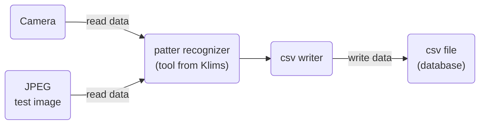
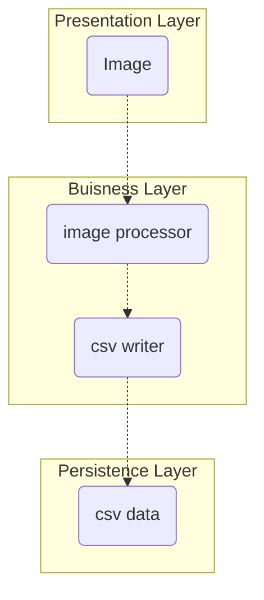

# Dokumentation

## Software Architecture

```mermaid
flowchart LR
    A("`Camera`") --> |read data| B("`patter recognizer
    (tool from Klims)`") --> C("`csv writer`") --> |write data| D("`csv file
    (database)`")
    E("`JPEG 
    test image`")
    E --> |read data| B
```
## Layered Pattern

```mermaid
flowchart TB
    subgraph Presentation Layer
    A("Image")
    end
    subgraph Buisness Layer
    B("image processor")
    C("csv writer")
    end
    subgraph Persistence Layer
    D("csv data")
    end
    A -.->B
    B -.->C
    C -.->D
```
## 

