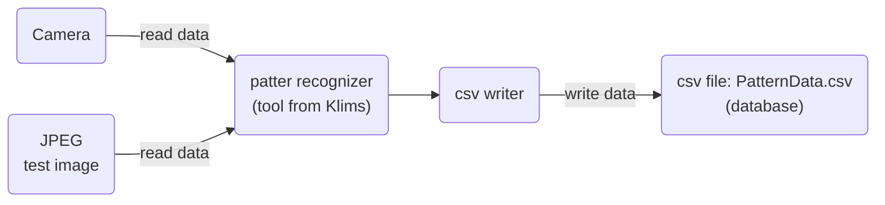
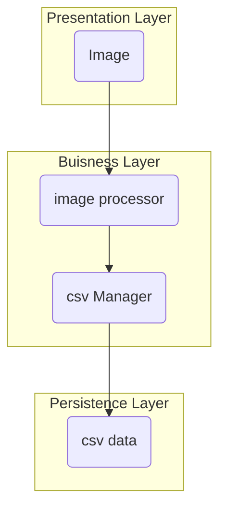

# Dokumentation

## Software Architecture

## Layered Pattern

## Klassen
### CSVmanager
#### Init
Erstellt eine CSV Datei "patternData.csv" mit den Spalten timestamp, Pattern name, color. 
#### writeCSV
Die Funktion writeCSV öffnet die zuvor erstellte csv Datei und schreibt die Daten des self.image.processor in diese Datei. Dazu schreibt er zuerst den timestamp dann den patternName und anschliessend die patternColor, jeweils mit Komma separiert, rein.
### CameraReader
#### Init

#### readCamera

### Image Processor (Klassen von Klims)
- Pattern
- Detector(ABC)
- ImageProcessor
- ColorDetector(Detector)
- PatternDetector(Detector)

Diese Klassen haben wir auf Grund fehlender Bildverarbeitungskenntnissen von Klims erhalten.

