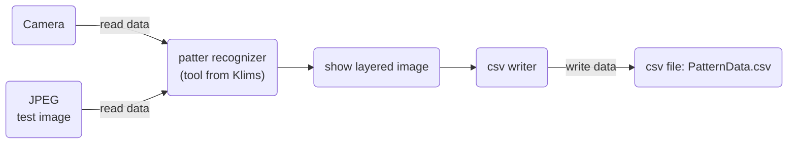
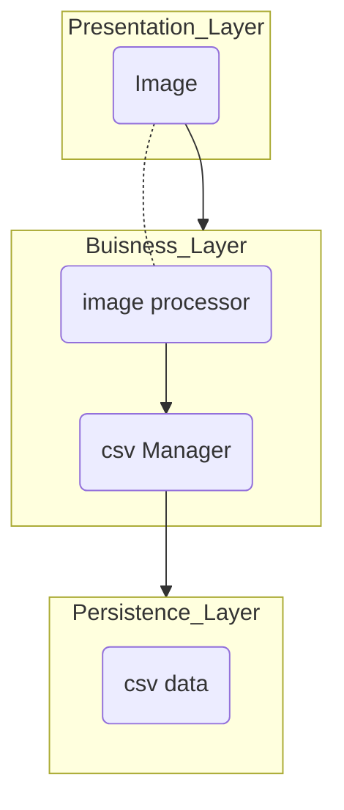

# Dokumentation

## Einleitung und Ziele
Die Software dient dazu in Echtzeit Muster in einem Lifestream zu erkennen. Dazu sollen verschiedene Formen und die dazugehörige Farbe erkannt und in eine csv Datei abgelegt werden. Die Mustererkennung soll im Lifestream zu sehen sein. 
- Formen: Quadrat, Rechteck, Dreieck, Kreis
- Farben: Rot, Grün, Blau, Gelb, Violett
- Input: Kamera z.B Webcam des Laptops
- Output: csv.Datei mit Zeit, Form, Farbe
## Lösungen und Strategie
Die Software wird aus verschiedenen Funktionen zusammengesetzt. So bleibt sie Modular und kann nach Wunsch erweitert werden.

## Software-Architektur

## Komponentendiagramm

## Funktionen und Klassen
### CSVmanager
#### Init
Erstellt eine CSV Datei "patternData.csv" mit den Spalten timestamp, Pattern name, color. 
#### writeCSV
Die Funktion writeCSV öffnet die zuvor erstellte csv Datei und schreibt die Daten des self.image.processor in diese Datei. Dazu schreibt er zuerst den timestamp dann den patternName und anschliessend die patternColor, jeweils mit Komma separiert, rein.
### CameraReader
#### Init
Stellt die Verbidnung zu der Webcam des Laptops her. Falls die Kamera nicht geöffnet werden konnte, wird eine Entsprechende Fehlermeldung angezeigt.
#### getImage
Die Kamera ausgelesen und in einem seperaten Fenster geöffnet. Die Mustererkennung wird auf dem laufenden Kamerafeed angezeigt.

### Image Processor (Klassen von Klims)
- Pattern
- Detector(ABC)
- ImageProcessor
- ColorDetector(Detector)
- PatternDetector(Detector)

Diese Klassen haben wir auf Grund fehlender Bildverarbeitungskenntnissen von Klims erhalten.

## get it started
### notwendige Extentions
Die Software wurde in VS-Code in Python geschrieben und getestet.
Um die Dokumentation sauber lesen zu können müssen folgende Extentions in VS Code installiert werden:
- Markdown All in One
- Markdown Preview Mermaid Support
### PC-Einstellungen
Um die Software auszuführen muss die Webcam des Laptops aktiviert und freigegeben sein. Falls zwei Kameras vorhanden sind, kann dies bei der Klasse Kamera im camera_index eingestellt werden. 
- camera_index = 0 -> Webcam des Laptops
- camera_index = 1 -> zweite Kamera 
### Poetry
Um sicherzustellen, das alle nötigen Module in der richtigen Version installiert werden kann Poetry verwendet werden. Dazu müssen folgende Schritte ausgeführt werden: https://python-poetry.org/docs/

1. Poerty via Powershell installieren
2. Poetry zu deinem Systempfad hinzufügen
3. Poerty updaten

Die verlinkte Webseite enthält alle Schritte in detaillierter Form.
###  Erster Start
1. Projekt im VS Code starten
2. Terminal öffnen
3. Poetry install ausführen
4. Poetry update ausführen
5. Environement einstellen: crtl+shift+p drücken -> Python Create Environment auswählen -> venv (virtual environment)
6. app.py öffnen
7. play drücken

Bei erneutem Ausführen müssen die Schritte 2.-5. nicht mehr ausgeführt werden.

